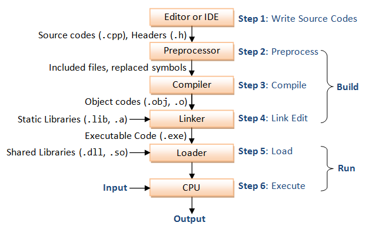

# C Programming syntax, Quick reference notes 

<br/>
<details>
 <summary><b>Download C compiler</b></summary>
<p>
 
https://ftp.gnu.org/gnu/gcc/gcc-9.3.0/
</p>
</details>

<br/>

<!-- comment in C Program -->
<details>
 <summary><b>Control Flow Of C Program </b></summary>
 <div align="center">
 <!--  -->
 </div>
</details>

<!-- comment in C Program -->
<details>
 <summary><b>Comment's in C Program </b></summary>
<p>
 
  ```C
  // used for single line comment 
  ```
  ```C
  /* used for the
  multi - line comment */
  ```
 </p>
</details>

&nbsp;

## Backslash Constant's / Escape sequence's
| character | description           | character | description           | 
|:---:      |                   :---| :---:     |                   :---|
| ```\a```        | alert(bell) character | ```\\```        | backslash             |
| ```\b```        | backspace             | ```\?```        | question mark         |
| ```\f```        | formfeed              | ```\'```        | single quote          |
| ```\n```        | new line              | ```\"```        | double quote          |
| ```\r```        | Carriage return       | ```\000```      | octal number          |
| ```\t```        | horizontal tab        | ```\ xhh```     | hexadecimal number    |
| ```\v```        | vertical tab          |           |                       |


&nbsp;

## ASCII values:
| Character | ASCII value| Character | ASCII value| Character | ASCII value| Character | ASCII value|
| :---:     |  ---:      | :---:     |  ---:      | :---:     |  ---:      | :---:     |  ---:      |
| **A** | 65| **Z** |  90| **0** | 48| **{** | 123|
|**a** | 97| **z** | 122| **9** | 57| **}** |124|

&nbsp;
