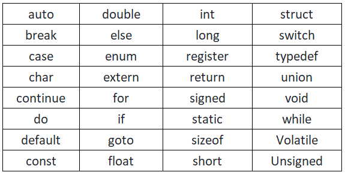

## Data types
<details>
 <summary> 
  <b>Types of Data types </b>
 </summary>
 <p>
  
  ### ***Primitive Data types***
  *data type provided by a programming language as a basic building block.*
  <br/>ex: int, char, float
  
  ### ***Derived Data types***
  *those that are defined in terms of other data types.*
  <br/>ex: array, function, pointer
  
  ### ***user defined Data types***
  *those which are developed by programmers by making use primitive and/or derived data types*
  <br/>ex: class, struct, union, enum
  
  ### ***Abstract Data types***
  ex: stack, queue, Linked-list
 </p>
</details>

### Primitive Data types

  | Data type | format specifier | size (_in Bytes_) | range(2ˣ-1)  |
  | ---:      |   :---:          | :---:             |          ---:|
  |int        | %d               | 2                 | -32768  -  +32767|
  |signed int | %d               | 2                 | -32768  -  +32767|
  |unsigned int | %d             | 2                 | 0  -  65535|
  |short int  | %d               | 2                 | -32768  -  +32767|
  |long int   | %ld              | 4                 | -2147483648  -  +2147483647|
  |float      | %f               | 4                 | -3.4E<sup>38</sup> - +3.4E<sup>38</sup> |
  |double     | %lf              | 8                 | -1.7E<sup>308</sup> - +1.7E<sup>308</sup> |
  |long double| %Lf              | 10                | -3.4E<sup>3942</sup> - +3.4E<sup>3942</sup> |
  |char       | %c               | 1                 | -128  -  +127|
  |signed char| %c               | 1                 | -128  -  +127|
  |unsigned char| %c             | 1                 | 0  -  255|
  
  _**note:** 2ˣ-1, here x is the no of bits_ 

<details>
 <summary> <b><em> type Conversion / type Casting </em></b> </summary>
 <p>

  ### ***1. Implicit***
  *automatically done by compiler.*
  
  ### ***2. Explicit***
  _when specified by programer_ <br/>
  ***example:***
  ```C
  int d;
  Char b = 'a';
  printf("%d",b); // implicit
  d = (int) b ;   // explicit
  ```
  
  ***explanation:*** _d will be having the ASCII value of b i.e d="98" and output will be 98 ._
  
 </p>
</details>


&nbsp;

## Keywords 
_**Keywords** are recerved words in a programming language they have a special meaning._
<details>
<summary><b>note:</b> <em>there are 32 keywords in c.</em></summary>
<div align="center">
<a href="keywords"></a>
</div>
</details>

&nbsp;

## Variables 
_a **variable** is a name given to a memory location, that is used to hold a value._


&nbsp;

## Constants vs Literals
_**Constants** are variables whose values can't be changed._

_whereas, **Literals** are literally numbers/letters that indicate the value of a variable or constant._


&nbsp;

## Identifiers 
_The **identifier** is only used to identify an entity uniquely in a program at the time of execution._

***example:*** name of a variable , name of a constant ....

&nbsp;

## Operators , Operands and Expressions
```C
#include<stdio.h>
#include<conio.h>
int main()
{
int a = 5;
const int b = 1;
int c = a + b * 10; // this is an expression

//int,const are keywords
//a,c are variables 
//b is a constant
//5, 1, 10 are literals
// *,+,= are operators
//variables, constant and literals used in above expression are operands. 

printf("%d",c); // output is 15,  why 15? BODMAS rule don't apply 

return 0;
}
```
**note:** an expression as ``x=0`` or ``i++`` becomes a ***statement***  when it is followed by a semicolon as in ``x=0;`` , ``i++;`` , ``printf(i);`` .

<details>
 <summary> <b><em> types of operator's </em></b></summary>
 <p>
  
  <ol>
   <li>
   <details>
    <summary> <b> Unary operators </b> </summary>
   <p>
    
   #### ***1. Unary minus ( - )***
   -(a)  = -a
   <br/>-(-a) = +a

   #### ***2. increment / decrement (++/--)***
   ***Increment ++***
    The increment operator increases the numeric value of its operand by 1. 
    <br/>
    When placed before the operand, it’ll return the incremented value. 
    <br/>
    When placed after it, it’ll return the original value and then increments the operand.
    
   ***Decrement --***
    The decrement operator decreases the numeric value of its operand by 1. 
    <br/>
    When placed before the operand, it’ll return the decremented value. 
    <br/>
    When placed after the operand, it’ll return the original value and then decrements the operand.
   
   ***example:***
   ```C
   print(a++);     // print a then increment 
   print(++a);     // increment then print a
   print(a--);     // print a then decrement
   print(--a);     // decrement then print a
   ```
   
   
   #### ***3. bitwise Complementation***
   ~(14)  = 1
   
   ~(0)   = 1
   
   #### ***4. Logical not ( ! )***
   ***example:***  !a , means not equal to a. 
    
   </p>
   <br/>
  </details>
  
   </li> 
   <li>
    <details>
     <summary> <b>Binary Operator</b> </summary>
    <p>
      
 #### ***1. Arithmetic***
     
 <table>
     <tr>
         <td align=center > <b> operator <b/> </td>
         <td align=center > <b> example <b/> </td>
         <td align=center > <b> answer <b/> </td>
     </tr>
     <tr>
         <td align=center >+</td>
         <td align=center >3 + 2</td>
         <td align=center >5</td>
     </tr>
     <tr>
         <td align=center >-</td>
         <td align=center >3 - 2</td>
         <td align=center >1</td>
     </tr>
     <tr>
         <td align=center > * </td>
         <td align=center >3 * 2</td>
         <td align=center >6</td>
     </tr>
     <tr>
         <td align=center >/</td>
         <td align=center >3 / 2</td>
         <td align=center >1.5</td>
     </tr>
     <tr>
         <td align=center >%</td>
         <td align=center >3 % 2</td>
         <td align=center >1</td>
     </tr>
 </table>
     
 #### ***2. Relational***     
 <table>
     <tr>
         <td align=center > <b> operator <b/> </td>
         <td align=center > <b> description <b/> </td>
     </tr>
     <tr>
         <td align=center >&amp;&amp;</td>
         <td>true, if both operands are true</td>
     </tr>
     <tr>
         <td align=center > || </td>
         <td>true, if either one is true</td>
     </tr>
 </table>
     
 #### ***3. Logical***
 <table>
     <tr>
         <td align=center > <b> operator <b/> </td>
         <td align=center > <b> description <b/> </td>
     </tr>
     <tr>
         <td align=center >&amp;&amp;</td>
         <td>true, if both operands are true</td>
     </tr>
     <tr>
         <td align=center > || </td>
         <td>true, if either one is true</td>
     </tr>
 </table>
      
***note:***  **" ! "**  is used as unary operator and is a logical operator, ex: !a  .
     
#### ***4. Bitwise operators***
<ul type=disc>
 <li> only used for integer values.</li>
 <li> firstly break the number(integer value) into its binary.</li>
</ul>

<br/>
     
<table>
     <tr>
         <td align=center > <b> operator <b/> </td>
         <td align=center > <b> description <b/> </td>
         <td align=center > <b> operator <b/> </td>
         <td align=center > <b> description <b/> </td>
     </tr>
     <tr>
         <td align=center >&amp;</td>
         <td align=center >12 &amp; 6</td>
         <td align=center >```&lt;&lt;```</td>
         <td align=center >```5 &lt;&lt; 6```</td>
     </tr>
     <tr>
         <td align=center ></td>
         <td align=center >1100 &amp; 0110</td>
         <td align=center ></td>
         <td align=center >```101&lt;&lt;6```</td>
     </tr>
     <tr>
         <td align=center ></td>
         <td align=center >0100</td>
         <td align=center ></td>
         <td align=center >101000000</td>
     </tr>
     <tr>
         <td></td>
         <td>= 4</td>
         <td></td>
         <td>= 320</td>
     </tr>
     <tr>
         <td align=center > | </td>
         <td align=center >12 | 6</td>
         <td align=center >```&gt;&gt;```</td>
         <td align=center >```13 &gt;&gt; 3```</td>
     </tr>
     <tr>
         <td align=center ></td>
         <td align=center >1100  | 0110</td>
         <td align=center ></td>
         <td align=center >```1101&gt;&gt;3```</td>
     </tr>
     <tr>
         <td align=center ></td>
         <td align=center >1111</td>
         <td align=center ></td>
         <td align=center >1</td>
     </tr>
     <tr>
         <td></td>
         <td>= 15</td>
         <td></td>
         <td>= 1</td>
     </tr>
     <tr>
         <td align=center >^ ("XOR")</td>
         <td align=center >13 ^ 10</td>
         <td align=center ></td>
         <td align=center ></td>
     </tr>
     <tr>
         <td align=center ></td>
         <td align=center >1101^1010</td>
         <td align=center ></td>
         <td align=center ></td>
     </tr>
     <tr>
         <td align=center ></td>
         <td align=center >0111</td>
         <td align=center ></td>
         <td align=center ></td>
     </tr>
     <tr>
         <td align=center ></td>
         <td align=center >= 7</td>
         <td align=center ></td>
         <td align=center ></td>
     </tr>
 </table>
      
#### table for Logical and Bitwise operators
 <table>
     <tr>
         <td align=center > <b> a </b> </td>
         <td align=center > <b> b <b/> </td>
         <td align=center > <b> a&amp;&amp;b , a&amp;b <b/> </td>
         <td align=center > <b> a || b , a | b <b/> </td>
         <td align=center > <b> a^b <b/> </td>
         <td align=center > <b> !a <b/> </td>
         <td align=center > <b> ~b <b/> </td>
     </tr>
     <tr>
         <td align=center >0</td>
         <td align=center >0</td>
         <td align=center >0</td>
         <td align=center >0</td>
         <td align=center >0</td>
         <td align=center >1</td>
         <td align=center >1</td>
     </tr>
     <tr>
         <td align=center >0</td>
         <td align=center >1</td>
         <td align=center >0</td>
         <td align=center >1</td>
         <td align=center >1</td>
         <td align=center >1</td>
         <td align=center >0</td>
     </tr>
     <tr>
         <td align=center >1</td>
         <td align=center >0</td>
         <td align=center >0</td>
         <td align=center >1</td>
         <td align=center >1</td>
         <td align=center >0</td>
         <td align=center >1</td>
     </tr>
     <tr>
         <td align=center >1</td>
         <td align=center >1</td>
         <td align=center >1</td>
         <td align=center >1</td>
         <td align=center >0</td>
         <td align=center >0</td>
         <td align=center >0</td>
     </tr>
 </table>
       
</p>
</details>
</li>
</ol>

&nbsp;

### Ternary operator (?:) "Conditional Operator" 
***syntax:***
```C
n = ((Condition)? value1: value2);
```

_n will get value1 if codition evaluate to true else n will get value2_.
 
&nbsp;

### Assignment operator
```C
i=i+2
i+=2    //same effect as above
x*=y+2
x=x*(y+2) //same effect as above
```

applicable for  +,-,*,/,%,>>,<<,&,^,\| 


&nbsp;

### Comma Operator ( , )
***example:*** 
```C
int a=2, b=4;
```
- evaluated from left to right. returns the rightmost value. 
- this operator has the lowest precedence.
- its important to use ( ) when used in expression.

***example:*** 
```C
sum = ( a=2, b=4 , a+b) ; // sum = 6
```
- this operator is used in for loop also.

***example:*** 
```C
for(i=0, j=9; i!=j; i++, j--);
```
                   
</details>

&nbsp;

## Operator Precedency and Associativity
| Operator                  | Precedency | Associativity |
|:---:                      |:---:       |:---:          |
|```{ , } , ( , )```        |     1      |  Left - Right |
|```- , ! , ~ , ++ , --```  |     2      |  Right - Left |
|```* , / , %```            |     3      |  Left - Right |
|```+ , -```                |     4      |  Left - Right |
|```<< , >>```              |     5      |  Left - Right |
|```< , <= , > , >=```      |     6      |  Left - Right |
|```== , !=```              |     7      |  Left - Right |
|```&```                    |     8      |  Left - Right |
|```^```                    |     9      |  Left - Right |
|  ```\|```                 |     10     |  Left - Right |
|```&&```                   |     11     |  Left - Right |
|  ```\|\|```               |     12     |  Left - Right |
|```?:```                   |     13     |  Right - Left |
|```=```                    |     14     |  Right - Left |
|```,```                    |     15     |  Left - Right |

***note:*** *.* _dot operator has the highest precedency._


&nbsp;
  
## ```#include<math.h>```
```C
#include<math.h>
pow(x,3)        // x^3
sqrt((int)n)    // √n 
```


&nbsp;

##  ```#include<ctype.h>```
the function ***tolower(C)*** returns lower case of C if C is in upper case.

and, you may use ***isspace(C)*** to check if C is a ***space***.

and, you may use ***isdigit(C)*** to check if C is a ***digit***.
