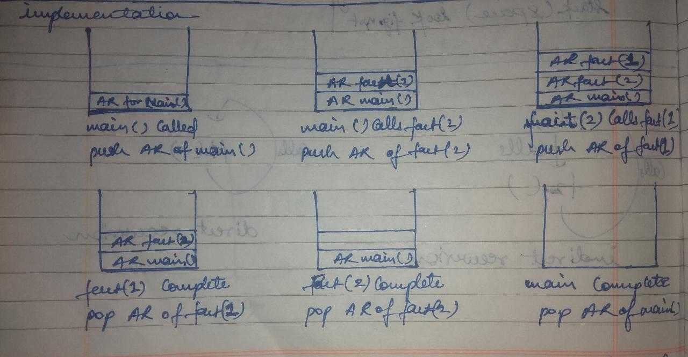

# Recursion
recursion is a programming technique using function or algorithm that calls itself,
  one or more times until a specified condition is met.

 

## base Condition for recursive calls
for the recursion to terminate there is a termination condition, where function stops calling itself,
  and the recursive calls should proceed in such a way that we finally hit the base condition.

 

## direct vs indirect recursion
[watch this video](https://youtu.be/t9whckmAEq0)

 

## Recursive function in Stack

 

## examples of Recursion

### 1. binary search using recursion

### 2. fibonacci series

### 3. Tower of Hanoi using recursion

 

## Tradeoffs between Recursion and Iteration
<table align=center>
<tr>
<td width=300 align=center>

***Recursion***
</td>
<td width=300 align=center>

***Iteration***
</td>
</tr>
<tr>
<td>

- easy to Understand
- best use for trees
- deep recursion can cause stack overflow
</td>
<td>

- generally faster
- requires less space
- harder to implement in complex problems
</td>
</tr>
<tr>
<td>

example: in factorial program using recursion.

Time complexity: depend on number of recursive calls.
i.e O(n)

Space Complexity: depend on call stack that increases as the recursive calls increases 
i.e O(n)
</td>
<td>

example: in factorial program using iteration.

Time complexity: depend on number of iterations.
i.e O(n)

Space Complexity: same variable are utilised in each iteration.
hence, Constant i.e O(1)
</td>
</tr>
</table>
Note: Every recursive problem can be solved through iteration. it's a good choice to convert recursion to iteration. if it is easy to implement and solve a problem using iteration prefer iteration.

[watch this video](https://youtu.be/hK01dEvdN_s)

 

## Stack Overflow error
while solving a recursive problem the solution space for the problem converges to base condition.
 ***the base condition is important***, otherwise the function will keep on calling itself till the stack is exhausted.
exhausted stack won't be able to store variables for next recursion and hence is called _stack overflow error_. 

 

## how to avoid Stack Overflow error
### tail Recursion | ***tail call optimization***
- A recursive function is tail recursive when a recursive call is the last thing executed by the function. 
- tail recursive functions can be optimized by the compiler, hence better choice.
- [watch this video first](https://youtu.be/Wpkh5YSqwqg)
- [then watch this video](https://youtu.be/HIt_GPuD7wk)
- [then watch this video](https://youtu.be/_JtPhF8MshA)

 
