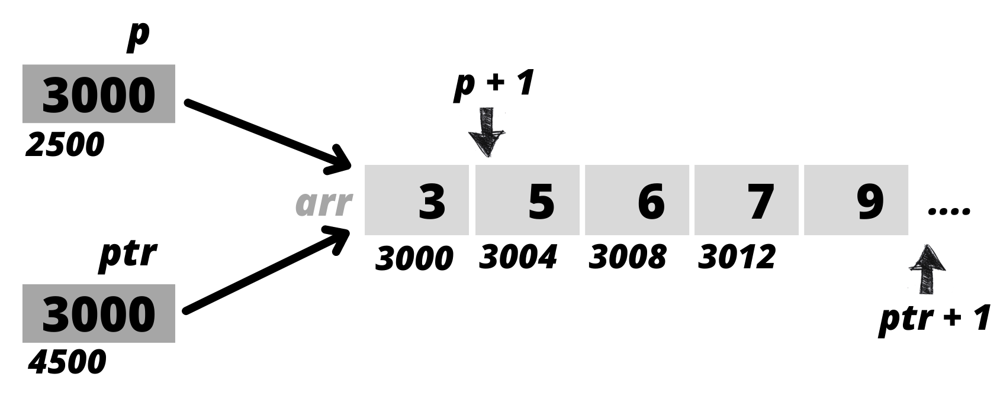

## Pointer to an Array (Array Pointer) 
- we can declare a pointer that can point to the whole array, instead of 1st element of array.

```C
  int (*ptr)[5] = &arr ;
         ^   ^    ^
         |   |    '----- cuz it will point to the whole array and ptr++ to the next array.
         |   '---------- pointer to an array of 5 int .
         '-------------- subscripts have higher precedence than indirection therefore ``( )`` necessary.  
```

***Note:*** ***if ``&`` is not used it will point to ``I`` element and ``ptr++`` will point to ``II`` element of array.***

</br>

<table>
<tr>
<td><b><em> Pointer to integer </em></b></td> 
<td><b><em> Pointer to an array of integers </em></b></td> 
</tr>
<tr>
<td>  

```
  p = arr          // ='s to 0012FEAC
  p++              // to next integer if exist
  printf("%p",p);  // ='s 0012FEBO
  printf("%p",*p); // ='s 3
```
</td>
<td>  

```
  ptr = &arr         // ='s to 0012FEAC
  ptr++              // point to next array of integers if exist
  printf("%p",ptr);  // ='s 0012FECO
  printf("%p",*ptr); // ='s 0012FECO
```
</td>
</tr>
<tr>
<td colspan="2" align="center">
<a href="#"></a>
</td>
</tr>
<tr>
<td colspan="2">
  
- sizeof(arr) = 20 ``//`` **``4*5``**.
- sizeof(arr+1) = 4 ``//`` **``i.e an element``**.

</td>
</tr>
<tr>
<td colspan="2">
  
- sizeof(*p) = 4    ``//depends upon the base type of`` **``value at``** **``p``**. ``i.e int have 4 bytes.``
- sizeof(*ptr) = 20 ``//depends upon the base type of`` **``value at``** **``ptr``**. ``i.e an array of 5 elements, of base type int, hence`` **``5*4``** ``bytes.``

***note:*** _``*pointerName`` denotes the value at address stored by pointer variable(pointer name), hence sizeOf(*ptr) is actually the size of value i.e an array(base type)._
</td>
</tr>
<tr>
<td colspan="2">
  
- sizeof(p) = 4   
- sizeof(ptr) = 4 
  
***note:*** _size of pointer variable is same for all types of pointer(i.e 4 bytes), hence pointer will always need 4 bytes to store address of single variable._
</td>
</tr>
<tr>
<td colspan="2">
  
***most-important-note!*** _but the size of pointer to array("Array Pointer") will depend on the size of array and its base type._

</td>
</tr>  
</table>


