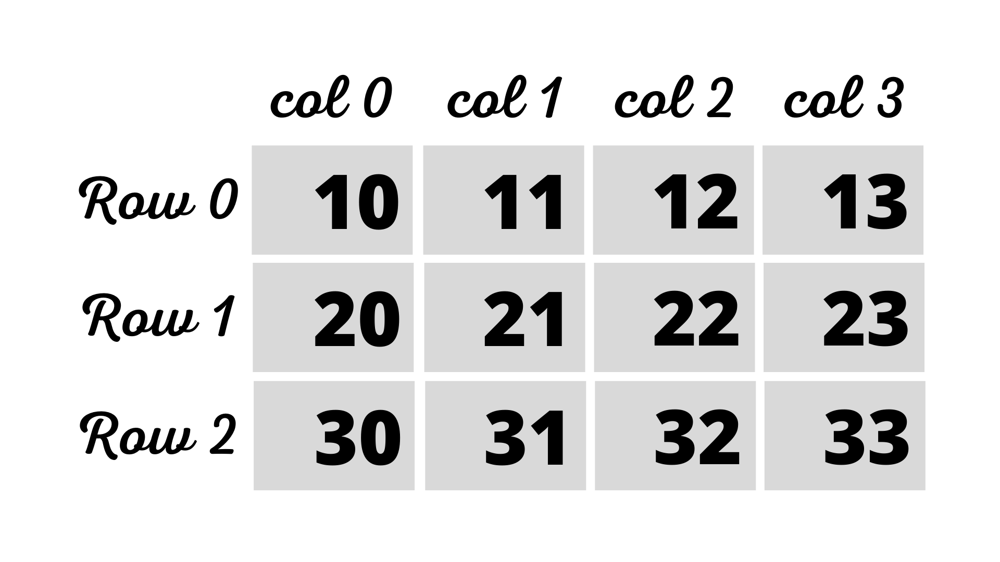
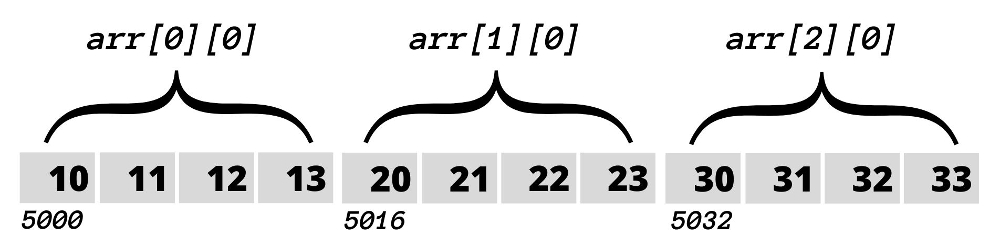
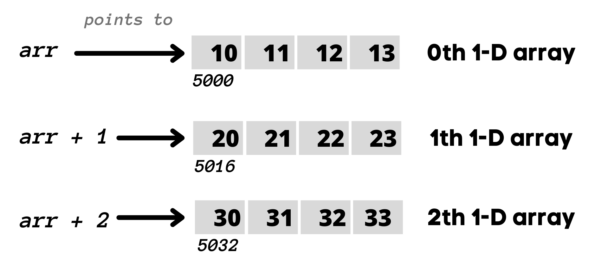
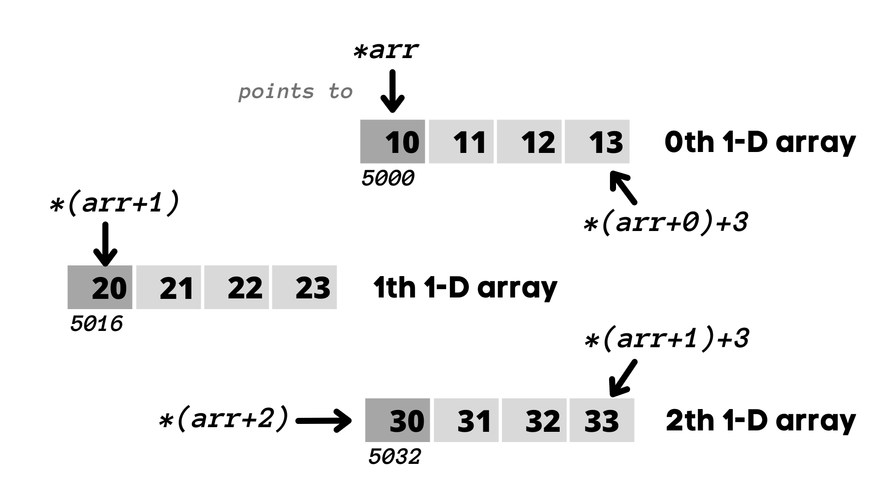

# pointer and 2D array

```C
  int arr[3][4] = { {10, 11, 12, 13}, 
                    {20, 21, 22, 23}, 
                    {30, 31, 32, 33} };
```

<table>
<tr>
<td>

<a href="#"></a>

- the Concept of rows and cols is only theoritical actually a 2-D array is stored in ***row major order*** i.e ``rows are placed next to each other``.
 
<a href="#"></a>

- each row can be considered as 1-D array, so a 2-D array can be considered as a collection of 1-D array.
- here _arr is an array of 3 elements, where each element is a 1-D array of 4 integers._
- name of an array is a pointer that points to the 0<sup>th</sup> element of array. in case of 2-D array, 0<sup>th</sup> element is a 1-D array. hence, name of 2-D array represent a pointer to a 1-D array
  
</td>
</tr>
<tr>
<td>

- ***Example:*** arr is a pointer to 0<sup>th</sup> 1-D array and contains ``5000 i.e address`` as value.
- **according to ``pointer arithmetic``**.

<a href="#"></a>

- since ``arr+i`` points to i<sup>th</sup> element of array. alternatively we can say ``arr+i`` holds address of i<sup>th</sup> element of array. 
- since i<sup>th</sup> element of 2-D array is a 1-D array. hence, ``arr+i`` points to i<sup>th</sup> 1D array. and holds base address of 1-D array.

- on dereferencing the i<sup>th</sup> element of 2-D array we'll get reference to i<sup>th</sup> element of 1D array.
  
<a href="#"></a>

</td>
</tr>
</table>

