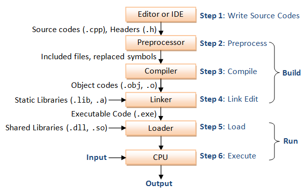

# C++ Programming Notes

 

<!--

	
 <b><em> Life cycle of C++ program </em></b> 

-->

<figure>

	<figcaption>   <b>fig: </b>life cycle of c++ program </figcaption>
</figure>

<!--

-->

 

	
 <b><em> what is C++ ??????????? </em></b> 

***Answer:***

 

	
 <b><em> Usage of C++ ? </em></b> 

***Answer:***
_C++ is a very powerful **systems programming language** , it is used in operating Systems, games and graphic engines, embedded systems, device drivers, development tools and much more. most notably it is used -_

- In scientific Applications where speed is very important.
- In Embedded Applications where resources are limited.
- In Video Games and Graphic Applications where environment is constrained.
- In complex Applications with millions of lines of code, such as compiler, browser, 
- In Banking and trading systems where latency is important.
- In computer vision and image processing libraries such as OpenCV.
- C++ being effective and efficient in proper utilization of resources, it is widely prefered in competetive coding.
	
> _although c++ is not a leading language, and the fact that most work requiring c++ is legacy systems, and in highly computational, complex systems with constrained environment. it is used by major companies such as BMW, Apple, Amazon, siemens..._

creator Bjarne Stroustrup talks about Applications in<a href="https://youtu.be/UdTzHmjMYBc"> this video...</a>, for more about applications <a href="https://www.stroustrup.com/applications.html"> read this...</a>

 

	
 <b><em> C vs C++ ??????? </em></b> 

***Answer:***

